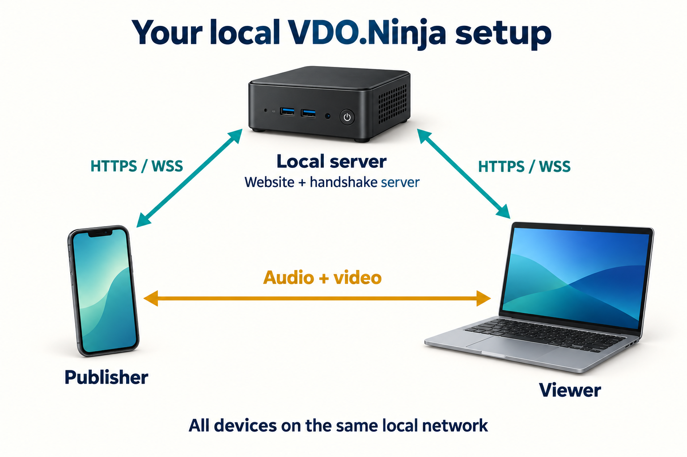
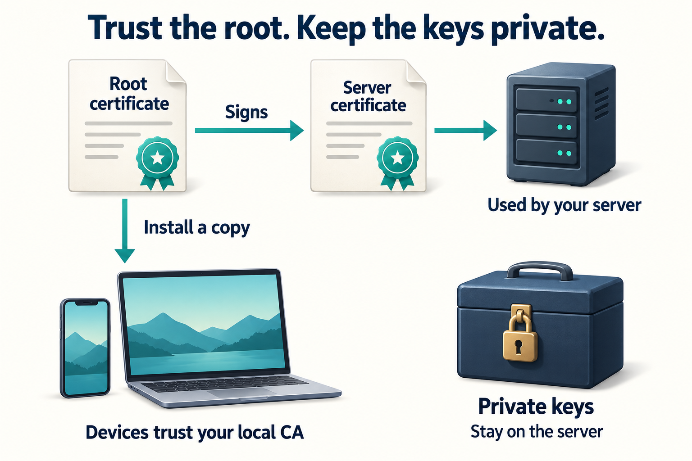

<!-- START doctoc generated TOC please keep comment here to allow auto update -->
<!-- DON'T EDIT THIS SECTION, INSTEAD RE-RUN doctoc TO UPDATE -->
**Table of Contents**

- [VDO.Ninja on your local network](#vdoninja-on-your-local-network)
  - [Find your next step](#find-your-next-step)
  - [What you are setting up](#what-you-are-setting-up)
  - [1. Choose a stable server address](#1-choose-a-stable-server-address)
  - [2. Install the tools](#2-install-the-tools)
  - [3. Download and prepare the website](#3-download-and-prepare-the-website)
  - [4. Create your local certificates](#4-create-your-local-certificates)
  - [5. Start the secure server](#5-start-the-secure-server)
  - [6. Trust the root and test two browsers](#6-trust-the-root-and-test-two-browsers)
  - [7. Connect the native app](#7-connect-the-native-app)
  - [Optional hybrid use with internet access](#optional-hybrid-use-with-internet-access)
  - [What to do next](#what-to-do-next)

<!-- END doctoc generated TOC please keep comment here to allow auto update -->

# VDO.Ninja on your local network

Run your own VDO.Ninja website and secure handshake server on a Linux computer or Raspberry Pi. Once prepared, the basic browser-to-browser setup can run without an internet connection.

**Start with the ordinary installation below.** You do not need Docker, Caddy, a domain name, or a separate handshake-server package. [Docker is an optional installation path](docs/docker.md).

This guide targets a private LAN: devices on the same home, studio or event network. A public VPS needs additional networking and access-control planning; see [other deployment setups](docs/other-setups.md). The current server is a small LAN signaling example, not a hardened public hosting service.

## Find your next step

| You want to… | Start here |
|---|---|
| Understand the parts | [What you are setting up](#what-you-are-setting-up) |
| Install on Linux or a Raspberry Pi | [Step 1](#1-choose-a-stable-server-address) |
| Trust your certificate on a phone or computer | [Device instructions](docs/certificates.md) |
| Connect the native Android/iOS app | [App settings and current limitations](#7-connect-the-native-app) |
| Use internet-assisted connections (hybrid) | [Optional STUN/TURN](#optional-hybrid-use-with-internet-access) |
| Fix a connection | [Troubleshooting](docs/troubleshooting.md) |
| Start at boot or renew a certificate | [Maintenance](docs/maintenance.md) |
| Use Docker or an existing Caddy setup | [Docker](docs/docker.md) · [Other setups](docs/other-setups.md) |
| Check what has actually been tested | [Validation](docs/validation.md) |

## What you are setting up



| Part | What it does |
|---|---|
| **Website** | The VDO.Ninja page you open in a browser. |
| **Handshake server** | Helps publishers and viewers find each other and exchange connection details. Also called the signaling server. |
| **HTTPS / WSS** | Encrypted connections to the website and handshake server. WSS means secure WebSocket. |
| **Certificate** | Lets a device verify the identity of the server it is connecting to. |
| **Local CA** | Your own certificate authority: it signs your server certificate. Devices must trust its public root certificate. |
| **Salt** | A shared setting used by VDO.Ninja clients when deriving identifiers/encryption information. This guide uses `vdo.ninja`. It is not a server address or a password. |

The included `server.js` serves both the website and signaling on one HTTPS port. It uses the advanced routing protocol: the server assigns peer identities and delivers messages to their intended peers. On a typical LAN, the audio/video goes directly between devices. The server is not a media relay. The illustration shows the usual direct connection, not every possible network topology.

**Before you begin:** use a current Raspberry Pi OS, Debian or Ubuntu installation, a regular Linux user with `sudo` access, and a phone/computer for testing. Use the same LAN, avoid guest Wi-Fi/client isolation, and check that the clocks are correct. Camera/microphone access requires a trusted secure browser connection.

The commands below run in a **terminal on the Linux server**, unless a step says otherwise. Replace `192.168.1.28` with your own server IP everywhere. Use a folder path without spaces for the service examples.

## 1. Choose a stable server address

Find the server's LAN address:

```sh
hostname -I
```

Choose its LAN address, not a Docker/VPN address. In your router, reserve that address for the server (often called a **DHCP reservation**). This avoids having to change links and certificates when the server restarts.

We will use these example values:

| Setting | Example |
|---|---|
| Server address | `192.168.1.28` |
| Website | `https://192.168.1.28:8443/` |
| Handshake server | `wss://192.168.1.28:8443` |
| Salt | `vdo.ninja` |

Port **8443** lets a regular user run the server without administrator privileges. Keep `:8443` in the links. Port 443 is possible with a separately configured service/proxy, but is not needed for this guide.

**Checkpoint:** another device is on the same LAN, and you know which IP belongs to the server.

## 2. Install the tools

Internet access is needed here and while downloading the website and Node dependencies.

```sh
sudo apt update
sudo apt install -y git openssl nodejs npm
node --version
npm --version
openssl version
```

Use **Node.js 22 or newer**, preferably a supported LTS release. Some older Linux distributions supply an older Node version: if so, stop here and follow the [official Node.js installation options](https://nodejs.org/en/download), then check `node --version` again. The setup script checks this before proceeding. No compiler or VDO.Ninja frontend build is required.

## 3. Download and prepare the website

```sh
mkdir -p ~/vdo-local
cd ~/vdo-local
git clone https://github.com/steveseguin/offline_deployment.git
cd offline_deployment
bash install.sh
```

The installer installs the locked Node dependencies and downloads the VDO.Ninja revision recorded in `vdoninja-version.txt` into **this folder's `site/` directory**. It applies the existing self-hosting settings to that deployment copy:

- Secure signaling at the same address and port as the page.
- The advanced routing protocol (`customWSS = false`, also selected by the browser's `wss2` URL option).
- Salt `vdo.ninja`.
- Public STUN/TURN disabled in the website by default, because this setup targets offline LAN use. See [optional hybrid use](#optional-hybrid-use-with-internet-access) to enable them per browser link.

It does not modify another VDO.Ninja checkout, install a system service, generate certificates, or change operating-system settings. It refuses to overwrite an existing `site/`; see [updating/recovering the website](docs/maintenance.md#update-the-website).

**Checkpoint:** the last output says `Website ready`, and `site/index.html` exists.

## 4. Create your local certificates

```sh
node scripts/create-certificates.js 192.168.1.28
```

If you also have a hostname that every device can resolve, include it now:

```sh
node scripts/create-certificates.js 192.168.1.28 studio.home.arpa
```

Choose one command for the initial creation. The helper includes the supplied addresses in the certificate's **Subject Alternative Names** (the names a client checks). It does not create DNS records. Pass addresses only, without `https://`, ports or paths.



| Created file | Purpose | Share it? |
|---|---|---|
| `certs/rootCA.crt` | Public root certificate to trust on your devices | Yes, with your intended users |
| `certs/rootCA.key` | Private key used to sign server certificates | **No** |
| `certs/server.crt` | Server identity, signed by your CA | Public, but not the root users should install |
| `certs/server.key` | Private key used by the HTTPS server | **No** |

The helper preserves existing certificates by default. The root lasts 10 years and the server certificate 397 days. [Renew explicitly](docs/maintenance.md#renew-the-server-certificate) before expiry or when the address changes. Keep a secure backup of `certs/`, outside the website folder. The CA key can also be kept in a secure offline backup between renewals; the running server only needs its own key and certificate.

**Checkpoint:** the helper prints the server addresses, expiry date, and root SHA-256 fingerprint. Save the fingerprint so you can compare it when installing the root on devices.

## 5. Start the secure server

Run these commands from `offline_deployment`:

```sh
export PORT=8443
export WEB_ROOT="$PWD/site"
export CERT_PATH="$PWD/certs/server.crt"
export KEY_PATH="$PWD/certs/server.key"
export UV_THREADPOOL_SIZE=2
node server.js
```

Leave this terminal open. The website and handshake server are now on the **same port**. To stop the server, press **Ctrl+C**. The `export` settings apply to this terminal; repeat them in a new terminal or use the [optional startup service](docs/maintenance.md#start-at-boot).

If your firewall blocks access, allow inbound TCP 8443 from your LAN using its normal administration tools. Do not disable the firewall. No router internet port-forwarding is required for devices on the same LAN.

In a **second server terminal**, check the certificate and secure WebSocket connection:

```sh
cd ~/vdo-local/offline_deployment
node scripts/check-connection.js https://192.168.1.28:8443/ certs/rootCA.crt
```

**Checkpoint:** both checks print `PASS`. This checks HTTPS and the WebSocket upgrade; it does not establish that media, the salt, or a phone app works.

## 6. Trust the root and test two browsers

Copy **only `certs/rootCA.crt`** to each device using a trusted transfer, such as USB or an existing secure file transfer. Compare its fingerprint with the server's value. Follow the [Windows, Android, iOS, macOS and Linux trust instructions](docs/certificates.md).

1. Open `https://192.168.1.28:8443/` in the publishing device's browser. It should open without a certificate warning.
2. Open `https://192.168.1.28:8443/?push=lancheck` and start the camera/microphone. Allow the browser's permission request.
3. On a second device, open `https://192.168.1.28:8443/?view=lancheck`.
4. Confirm both picture and sound. If a password is set, use the same one at both ends.

Keep the local address in shared links. A link beginning `https://vdo.ninja/` loads the public site instead of this local copy. Stop these test streams when finished.

**Checkpoint:** the second browser receives the first device's stream. Next, disconnect the network's internet uplink while keeping the LAN/Wi-Fi running, reload both pages, and repeat. Do this only when it will not interrupt other users. Phones may need cellular data disabled for a meaningful offline check.

Basic camera/microphone push/view is the target. Features that explicitly contact external services still need those services; installing the website does not make every integration available offline.

## 7. Connect the native app

**Start by installing and trusting the public root on the phone**, as described in [device instructions](docs/certificates.md), then test the app with the settings below. No app certificate-import feature is needed in this guide. **Known Android limitation:** on a Pixel 4a running Android 13, app **5.0.103** still rejected the certificate after CA installation and a full app restart, while Steve confirmed Brave opened the same site without a certificate error. Installing the CA alone did not fix this app build. A local **5.0.104 candidate** now includes a tested Advanced Settings certificate exception for the selected custom WSS host and port. It is off by default, clears when the endpoint changes, and keeps encryption while skipping identity checks, including hostname and expiry. This is a development build, not a confirmed public release. See the [Flutter follow-up results](docs/flutter-handoff.md).

Use these settings for the app test:

| App field | Value for this guide |
|---|---|
| Handshake server | `wss://192.168.1.28:8443` |
| Custom Salt | `vdo.ninja` |
| TURN server | Leave at the app default for the initial same-LAN test; see the separate app behavior below |
| WHIP output | Off for this handshake-server test |

**The website and native app have separate STUN/TURN settings.** In the reviewed Flutter app, an empty TURN field or its placeholder fetches public TURN servers; it does **not** disable them. The website's offline setting does not configure the app. Internet-assisted app tests are not proof of disconnected operation.

Enter the handshake address **first**, leave that field, then enter the salt. Older builds can replace the salt when the handshake field loses focus; recheck it before connecting. The local 5.0.104 candidate preserves an explicitly entered salt. An IP address is accepted. The certificate must cover that exact IP.

For iOS, installing a root profile also requires explicitly enabling SSL trust. That platform path may work, but this exact app/server combination has not been device-verified here. See [iOS instructions](docs/certificates.md#iphone-and-ipad).

For Marcos's existing Caddy setup, his external port is **443**, so his address remains `wss://192.168.1.28:443`. He needs to trust **Caddy's** root CA, not a new root generated by this helper. [Existing Caddy setups](docs/other-setups.md#already-using-caddy).

The app's handshake field takes the plain `wss://...` address; do not append `&wss2=` there. `wss2` is a **browser URL option**. This server now implements the routed messages expected by the reviewed Flutter code, including requests without `from` and room listings. App 5.0.103 generated a viewer link with `wss=`; change that browser link option to `wss2=` for this server. The local 5.0.104 candidate corrects that link and passed direct publishing, room publishing, built-in microphone audio and recovery after a signaling-server restart. These functional results do not qualify smoothness or internet-disconnected operation.

USB microphone and Android USB camera verification are deferred. Built-in microphone success does not establish USB support. When those checks resume, confirm the selected USB source at the receiving device; a moving local meter is not sufficient.

## Optional hybrid use with internet access

The prepared website keeps `session.configuration = {};`, disabling its automatic public STUN/TURN setup. This is intentional for offline use. **Keep that line unchanged.** The following browser URL options enable internet assistance for that link only; removing them restores the offline defaults.

STUN helps a device discover its public address. TURN relays media when a direct connection cannot be established. Public STUN/TURN requires internet access; TURN media may leave the LAN. Neither option makes your private website or handshake server reachable from outside your network.

For a simple STUN-assisted viewer test, replace the address and stream ID in:

```text
https://192.168.1.28:8443/?view=lancheck&stun=stun%3Astun.l.google.com%3A19302&turn=off
```

This enables Google STUN and leaves TURN off **in that browser**. It worked with Speedify in the recorded test, but STUN alone cannot traverse every network.

For a relay fallback, use a TURN service you operate or are authorized to use:

```text
https://192.168.1.28:8443/?view=lancheck&stun=false&turn=USERNAME%3BPASSWORD%3Bturn%3Aturn.example.net%3A3478
```

Replace the example credentials and hostname. The decoded `turn` value is `USERNAME;PASSWORD;turn:turn.example.net:3478`; URL-encode the complete value, including special characters in credentials. This example disables separate STUN servers and explicitly configures TURN. For TURN over TLS, use `USERNAME;PASSWORD;turns:turn.example.net:443` instead. Use the ports supported by your service. TURN credentials in a link are visible to anyone receiving it; use credentials intended for those clients.

Append `&relay` only when testing that the relay path itself works; omit it for normal direct-or-relay selection. Keep existing stream, password and `wss2` parameters. For two-browser publishing, add the desired options to both browser links (use `push=lancheck` for the publisher). For a native publisher, configure its TURN field separately; these URL options belong on the viewer link, not in the app's handshake field.

A VPN can interfere with LAN addresses and `.local` discovery even when HTTPS/WSS connects. On the tested Pixel 4a, the offline viewer stalled with Speedify enabled; pausing Speedify restored direct LAN media. With Speedify still enabled, explicitly adding viewer STUN or TURN also restored media. The app having TURN enabled alone did not compensate for the viewer's unresolved local addresses. See [test evidence and limits](docs/validation.md#offline-and-hybrid-connectivity-follow-up).

For genuinely offline operation, keep the defaults and establish a working LAN path, including checking VPN/client isolation. A local TURN relay is another possible deployment option, but is not included or validated by this guide. Public TURN cannot provide a fallback after the internet connection is removed.

## What to do next

- [Start at boot, renew certificates, update or uninstall](docs/maintenance.md).
- [Troubleshoot by symptom](docs/troubleshooting.md).
- [Optional Docker instructions](docs/docker.md).
- [Advanced routing protocol and migration notes](docs/signaling-server-review.md).

Older Raspberry Pi disk images and old copied installation commands may use different directories, certificates and ports. Use a fresh OS plus this guide for a new installation; do not assume an old image includes these changes. Existing deployments can keep their explicit `KEY_PATH`, `CERT_PATH` and `PORT`; `WEB_ROOT` now lets you select the website directory.
