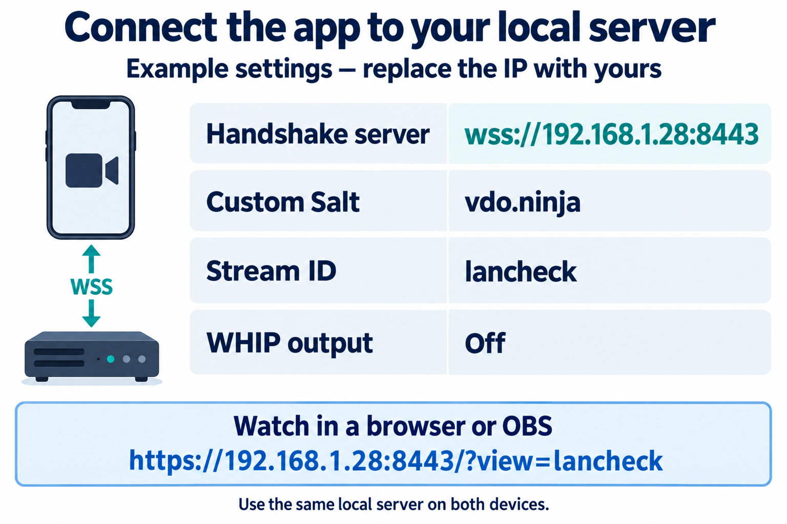

# Connect your phone or OBS

[Back to setup](../README.md)

Use your server's IP in place of **192.168.1.28**. These examples use port **8443**.

## First: trust the server

[Install `rootCA.crt`](certificates.md) on each phone/computer. Open `https://192.168.1.28:8443/` in its browser without a certificate warning.

## Native VDO.Ninja app

Open **Publishing Settings**, then enable **Advanced Settings** to see the connection fields.



*Example settings*

| Field | Enter |
|---|---|
| Stream ID | `lancheck` |
| Room name / Password | Leave blank for this first test |
| Handshake server | `wss://192.168.1.28:8443` |
| Custom Salt | `vdo.ninja` |
| TURN server | Leave at the default for this first LAN test |
| Enable WHIP output | Off |

Enter the handshake address first, leave that field, then enter the salt. Recheck both and press **CONNECT**. Allow camera/microphone access.

**Certificate error in the native VDO.Ninja app?** Check the address, certificate and device clock. If your app offers **Ignore certificate errors for this handshake server**, use it only for your own trusted server: it keeps encryption but skips identity checks.

On iOS, [enable full trust for the installed root](certificates.md#iphone-and-ipad).

## Watch in a browser

On another device, open:

```text
https://192.168.1.28:8443/?view=lancheck
```

Use the local address above, even if the app's share link opens `vdo.ninja`. Confirm picture and sound.

For an existing stream, replace `lancheck` with its ID and keep any password parameters. Browser handshake overrides use **`wss2=`** with this server; the app's handshake field takes only **`wss://IP:PORT`**.

## Watch in OBS

1. [Trust the root on the OBS computer](certificates.md), then restart OBS.
2. Under **Sources**, choose **+ → Browser**.
3. Paste the local viewer URL above into **URL** and click **OK**.
4. Check the picture and OBS audio mixer. Make a short recording to confirm sound.

## Connected, but no picture or sound?

Check camera/mic permissions, matching stream settings, and guest Wi-Fi isolation. Try pausing a VPN if it blocks LAN connections.

The native VDO.Ninja app uses public TURN servers by default, even with a blank TURN field. Its network settings are separate from the website. [Troubleshooting](troubleshooting.md) · [Optional internet assistance](hybrid.md)
